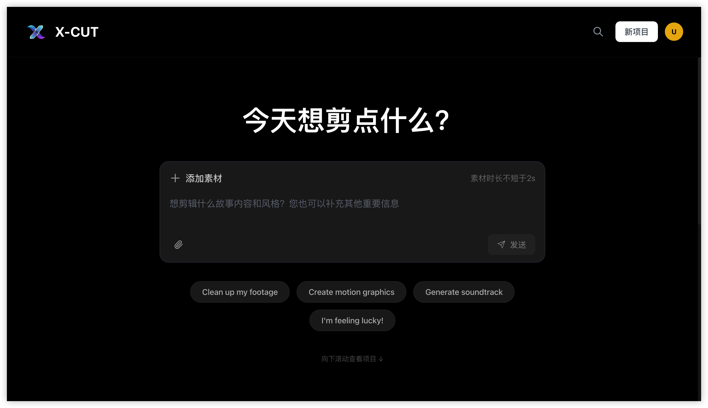
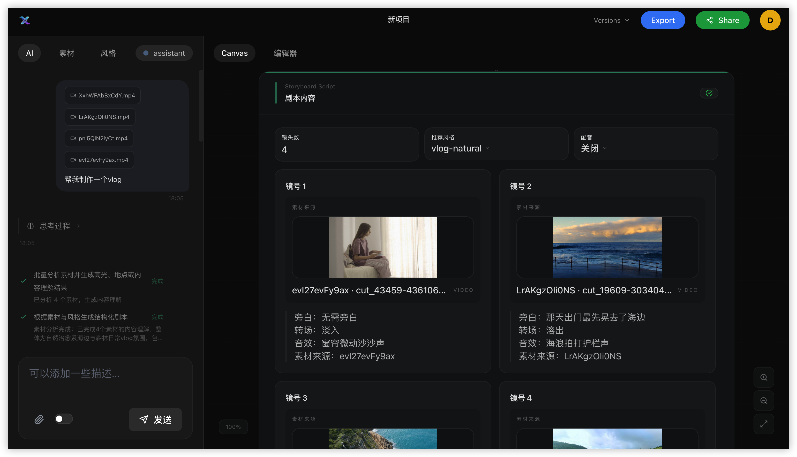
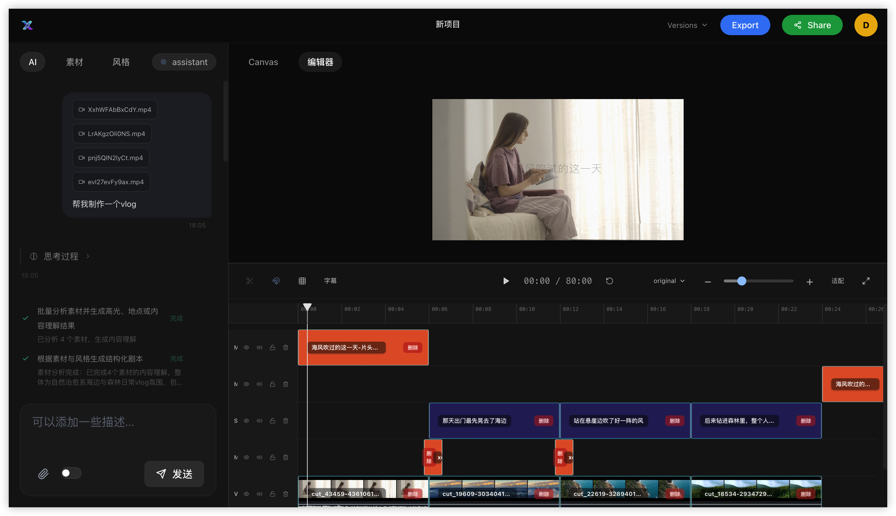

<div align="center">


# X-CUT: Chat-Driven Video Editing Agent with Real-Time Rendering

[](https://www.python.org/downloads/) [](https://react.dev/) [](https://www.typescriptlang.org/) [](https://fastapi.tiangolo.com/) [](https://www.remotion.dev/) [](https://github.com/agno-agi/agno) [](LICENSE)

[Features](#-key-features) · [Demo](#-demo) · [Get Started](#-get-started) · [Skill System](#-skill-system) · [Roadmap](#-roadmap)

[🇨🇳 中文](README_CN.md) · [🇬🇧 English](README.md)

</div>

---

## 📖 Overview

X-CUT is an AI video editing Agent that turns **natural-language conversations** into finished videos. Simply describe your idea in the chat interface; the Agent understands your intent, clarifies when needed, dynamically selects and combines skills, and edits a multi-track timeline. The entire process is rendered in real time onto tracks via Remotion — every step is instantly visible, and you can export with one click when you're happy.

No timeline dragging. No keyframe tweaking. Just chat with the Agent.

> **"Turn my travel footage into a Vlog with chill background music and subtitles"**
> — The Agent takes it from there: asset analysis, script generation, visual arrangement, music, dubbing, MG animation, and final rendering — all from a single sentence.

---

## ✨ Key Features

- 🎬 **Intelligent Asset Analysis & Script Generation:** Automatically analyzes uploaded video/image assets — shot scale analysis, camera movement analysis, and content understanding. Based on user intent and asset content, the Agent generates a script preview.
- 🎨 **MG Animation Generation:** Built-in LLM-powered MG animation code generator that leverages Remotion skills to turn natural-language instructions into Remotion JSX components in real time. Supports adding transitions, opening/ending titles, and any natural-language-described animation rendered to any position in the video, with both create and modify modes. Just describe what you want: "add a travel guide info card on the right side", "make the title more playful" — the Agent generates, transpiles, and renders it instantly.
- 🎵 **Smart Music, Dubbing & Subtitles:** Automatically generates background music matching the video mood based on asset analysis, synthesizes AI voiceover from script narration (with selectable voice styles and voice cloning), and renders timeline-aligned subtitles — all orchestrated by the Agent through a single conversation.
- 💬 **Chat-Based Editing:** Edit anything through conversation — add, remove, or modify dubbing, animations, subtitles, voice styles, and more. Rendered in real time via Remotion Player — what you see is what you export.
- 📌 **Reference-Based Modification:** The rendered result on the timeline is composed of original assets layered with generated dubbing, music, and animations. Any individual element can be referenced and modified without affecting the rest — enabling precise, surgical edits.
- 🖱️ **Drag-and-Drop Timeline:** Not satisfied with the AI-generated edit? Directly drag, reorder, delete, or add clips on the real-time rendered timeline.
- ⚡ **Editing Style Preservation & Sharing:** Save any project's editing recipe as a reusable Skill — capturing structure, pacing, music style, dubbing preferences, and MG animation patterns. Next time, just load new assets and apply the Skill to instantly replicate the same style, enabling efficient batch production. Also supports sharing via `.md` files.

---

## 🎬 Demo

### Interface Overview

<!-- TODO: Replace with actual screenshots / videos -->
| | | |
|:---:|:---:|:---:|
|  |  |  |
| *X-Cut Entry* | *Chat + Canvas* | *Chat + Editor* |

### Showcase

#### Vlog Creation

> **Assets:** 5 travel video clips  
> **Prompt:** *"Help me make a beach travel vlog"*

<table align="center">
  <tr>
    <td align="center"><b>Screen Recording</b></td>
    <td align="center"><b>Result</b></td>
  </tr>
  <tr>
    <td align="center"><video src="https://github.com/MeiGen-AI/X-Cut/raw/main/assets/videos/vlog-creator.mp4" controls width="420"></video></td>
    <td align="center"><video src="https://github.com/MeiGen-AI/X-Cut/raw/main/assets/videos/vlog-res.mp4" controls width="420"></video></td>
  </tr>
</table>

#### Marketing Video Creation

> **Assets:** 9 product pictures (screenshot from Xiaomi's official website)  
> **Prompt:** *"Make a promotional video for the Xiaomi Yu7."*

<table align="center">
  <tr>
    <td align="center"><b>Screen Recording</b></td>
    <td align="center"><b>Result</b></td>
  </tr>
  <tr>
    <td align="center"><video src="https://github.com/MeiGen-AI/X-Cut/raw/main/assets/videos/marketing-creator.mp4" controls width="420"></video></td>
    <td align="center"><video src="https://github.com/MeiGen-AI/X-Cut/raw/main/assets/videos/marketing-res.mp4" controls width="420"></video></td>
  </tr>
</table>

#### Free Edit

> **Assets:** 1 video clip  
> **Prompt:** *"Generate a Hainan travel guide in the right third of the screen, mock some data, make it detailed."*  
> **Later:** *"Change the background to transparent."*

<table align="center">
  <tr>
    <td align="center"><b>Screen Recording</b></td>
    <td align="center"><b>Result</b></td>
  </tr>
  <tr>
    <td align="center"><video src="https://github.com/MeiGen-AI/X-Cut/raw/main/assets/videos/free-edit.mp4" controls width="420"></video></td>
    <td align="center"><video src="https://github.com/MeiGen-AI/X-Cut/raw/main/assets/videos/free-edit-res.mp4" controls width="420"></video></td>
  </tr>
</table>

> **Assets:** Multi video clips  
> **Prompt:** *"Add transitions to these materials"*  
> **Later:** *"1. Change to push-pull effect; 2. Add a forest VLOG title with Chinese-English layout, English as subtitle, plus some geometric decorative elements, transparent background."*

<table align="center">
  <tr>
    <td align="center"><b>Screen Recording</b></td>
    <td align="center"><b>Result</b></td>
  </tr>
  <tr>
    <td align="center"><video src="https://github.com/MeiGen-AI/X-Cut/raw/main/assets/videos/free-edit2.mp4" controls width="420"></video></td>
    <td align="center"><video src="https://github.com/MeiGen-AI/X-Cut/raw/main/assets/videos/free-edit-res2.mp4" controls width="420"></video></td>
  </tr>
</table>

#### Style Sharing and Replication

> Share your editing recipe as a reusable style via the "Share" button — export as `.md` or save to your space. Apply any style to a new project to instantly generate videos in the same style.

<table align="center">
  <tr>
    <td align="center"><b>Screen Recording</b></td>
  </tr>
  <tr>
    <td align="center"><video src="https://github.com/MeiGen-AI/X-Cut/raw/main/assets/videos/style-replication.mp4" controls width="420"></video></td>
  </tr>
</table>

---

## 🧩 Skill System

Skills are the backbone of X-CUT's Agent, organized by category and easy to extend. The Agent dynamically selects and combines skills based on user intent, enabling flexible and composable editing without rigid pipelines.

```
.xcut_skills/system/
├── entry/           → the single top-level skill loaded by the Agent
├── scenes/          → vlog-generation, marketing-generation, free-edit,
├── operations/      → audio-edit, dubbing-edit, mg-edit, opening-ending-edit,
│                      track-delete, transition-edit
├── styles/          → marketing-conversion, vlog-natural (shareable editing styles)
├── templates/       → marketing-hook-sell-cta, vlog-story
├── tools/           → analyze-assets, build-script, generate-visuals,
│                      generate-music, add-dubbing, mg-animation,
│                      resolve-voice-id, apply-timeline-strategy, references
└── prompt-specs/    → script-from-style
```

### How Agent + Skills Work Together

1. **Entry Skill** — The Agent always loads the entry skill as its single top-level capability.
2. **Scene Selection** — Based on user intent, the Agent selects the appropriate scene skill (vlog, marketing, etc.).
3. **Skill Staging** — `RuntimeSkillBuilder` copies the entry skill into a task-scoped directory, then stages selected scene/user/shared skills as references.
4. **Flexible Execution** — The Agent reads staged skill references and orchestrates tools accordingly — no rigid pipeline, just skill-driven intelligence.

### Style Sharing & Import

Styles are a special kind of skill that captures an editing recipe — structure, pacing, music genre, dubbing preferences, and more. Users can:

- **Browse** the Style Gallery on the home page to discover community styles
- **Preview** a style's full configuration before applying
- **Apply** any style to instantly start a new project with that creative direction
- **Share** your project's editing recipe to the community as a new style skill
- **Import** styles from `.md` files for sharing
- **Download** any style as a portable `.md` file

---


## 🚀 Get Started

We are preparing the open-source model/API integration guide — code coming soon.

---

## 🗺 Roadmap

| Status | Milestone |
|:---:|:---|
| 🔜 | Web code and deployment guide release |
| 🔜 | Standalone Skills release — pluggable into Claude, OpenClaw, and more |
| 🔜 | CLI version release |
| 🔜 | Long video decomposition & editing |
| 🔜 | Talking-head / narration video editing |
| 🔜 | One more thing ...... |

---

## 🤝 Contributing
---

## 📄 License

This project is licensed under the GNU Affero General Public License v3.0 — see the [LICENSE](LICENSE) file for details.

---

<div align="center">

**X-CUT** — Talk to the Agent. Enjoy your cut.

[Report Bug](../../issues) · [Request Feature](../../issues) · [Discussions](../../discussions)

</div>
